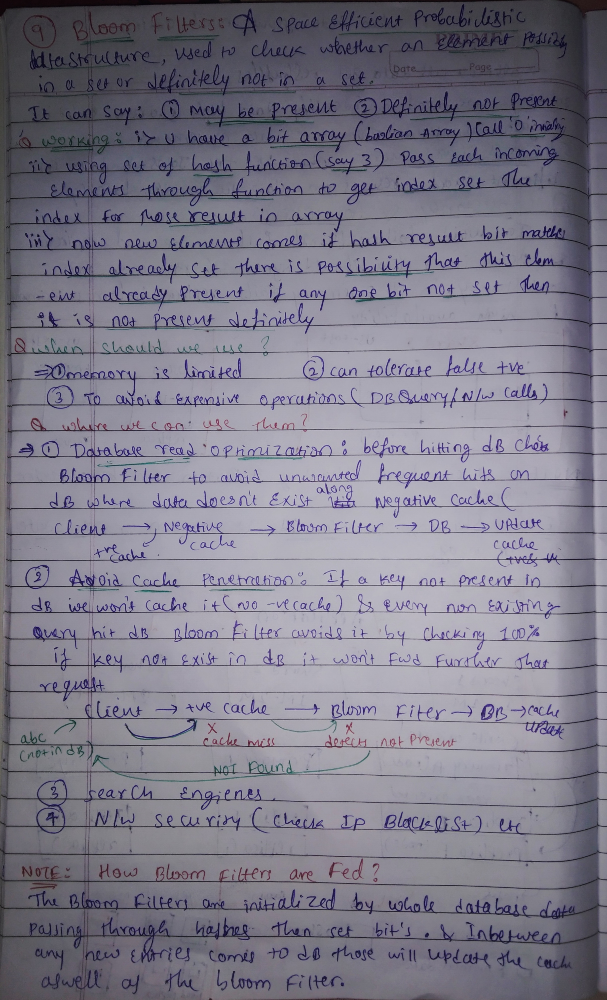
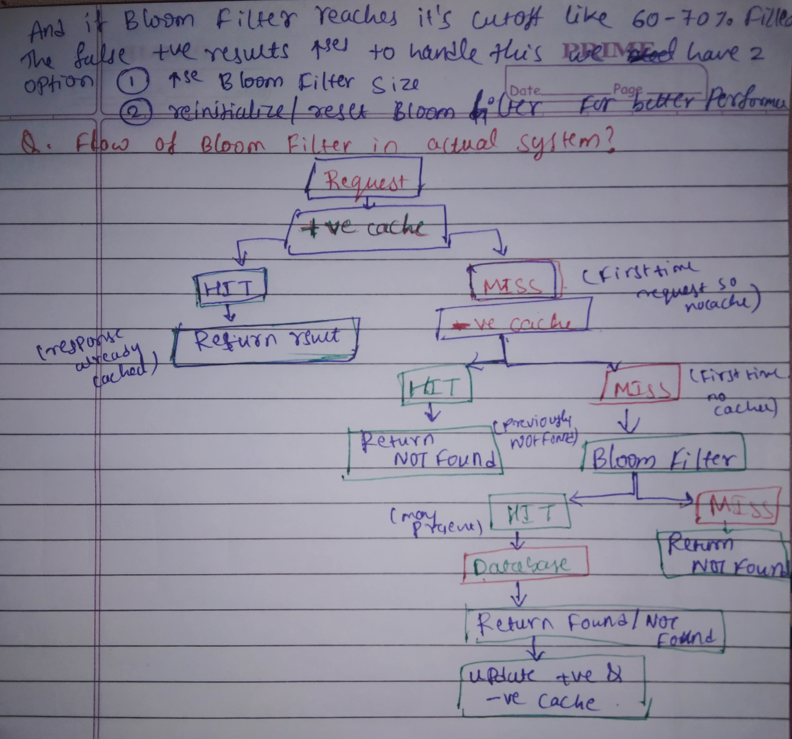
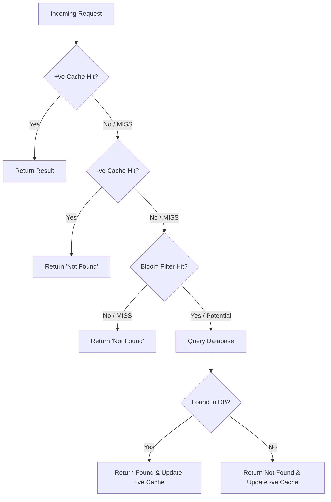

# 🚀 Bloom Filters: A Space-Efficient Probabilistic Data Structure

## 📝 Notes

  </img> 
  </img>

A **Bloom Filter** is a space-efficient probabilistic data structure used to test whether an element is a member of a set. It is designed to tell you rapidly and cheaply if an item is **definitely not** in a set or **potentially** in a set, trading a bit of accuracy for huge savings in **memory** and **latency**.

---

## 📚 Table of Contents

- [📌 Core Characteristics](#-core-characteristics)
- [⚙️ How It Works](#%EF%B8%8F-how-it-works)
- [🛠 When to Use Bloom Filters](#-when-to-use-bloom-filters)
- [🎯 Use Cases](#-use-cases)
- [🔄 System Design Flow](#-system-design-flow)
- [📝 Maintenance & Scaling](#-maintenance--scaling)

---

## 📌 Core Characteristics
* ✅ **Definitely Not Present:** If the filter says an item isn't there, it 100% isn't there.
* ❓ **May Be Present:** If the filter says an item is there, there is a small probability of a **False Positive**.
* 🚫 **No False Negatives:** It will never tell you an item is missing if it actually exists.

---

## ⚙️ How It Works
1.  **Initialization:** Start with a **Bit Array** (Boolean Array) of size $m$, all initialized to `0`.
2.  **Hashing:** Choose $k$ different hash functions.
3.  **Adding an Element:** Pass the element through all $k$ hash functions to get $k$ array indices. Set the bits at these indices to `1`.
4.  **Querying:** Pass the search term through the same $k$ hash functions.
    * If **any** of the bits at those indices are `0`, the element is **definitely not** in the set.
    * If **all** bits are `1`, the element **might** be in the set.

---

## 🛠 When to Use Bloom Filters
You should consider a Bloom Filter when:
* 💾 **Memory is Limited:** You need to track millions of items but can't fit them in a standard Hash Set.
* 🤏 **False Positives are Tolerable:** Your system can handle the occasional unnecessary check as long as it's not the norm.
* ⚡ **Avoiding Expensive Operations:** You want to prevent unnecessary Disk I/O, Database queries, or Network calls.

---

## 🎯 Use Cases
1.  🗄️ **Database Read Optimization:** Check the Bloom Filter before hitting the disk to avoid looking up keys that don't exist.
2.  🧠 **Avoid Cache Penetration:** Prevents "heavy" queries for non-existent keys from reaching the database by filtering them out early.
3.  🔍 **Search Engines:** Efficiently indexing and checking for the existence of URLs or keywords.
4.  🛡️ **Network Security:** Quickly checking IP addresses against a massive blacklist.

---

## 🔄 System Design Flow
This diagram illustrates how a Bloom Filter fits into a standard caching architecture to optimize performance and protect the database.

---

## 📝 Maintenance & Scaling
### 🔄 How they are fed
* 🏁 **Initialization:** Populated by passing the entire existing database through the hash functions during startup or background jobs.
* 🔁 **Updates:** Any new entry added to the database must simultaneously update the Bloom Filter and the cache.

### 📈 Managing Saturation
As more items are added, the bit array fills up. If the array reaches **60-70% occupancy**, the probability of False Positives increases significantly.

**Solutions:**
1.  📏 **Resize:** Increase the bit array size (requires re-hashing all data).
2.  🔃 **Reinitialize:** Reset the filter and re-populate it from the database for better performance.

### 💡 Pro-Tip
Bloom Filters **do not support deletion** easily. If you turn a bit from `1` to `0`, you might accidentally "delete" other elements that hashed to that same bit. If you need deletions, look into **Counting Bloom Filters**.