# ⚡ Caching

Notes:

  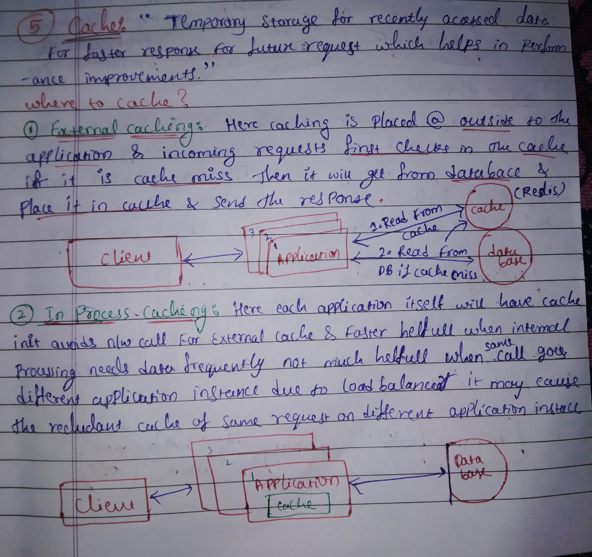 
  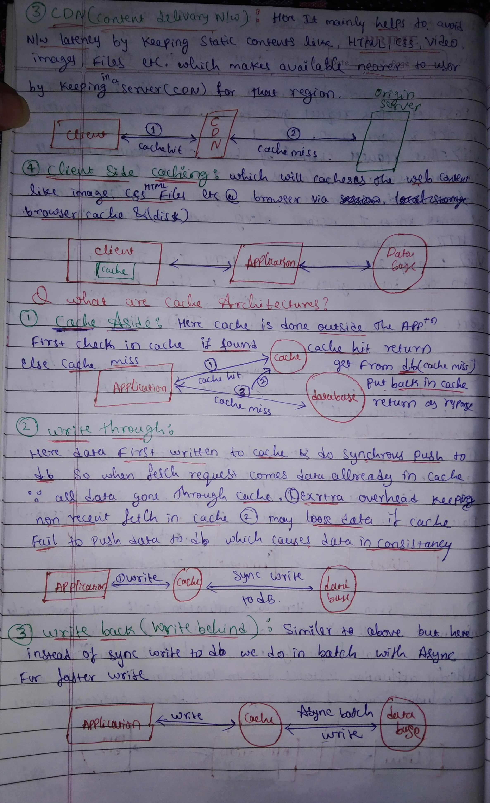 
  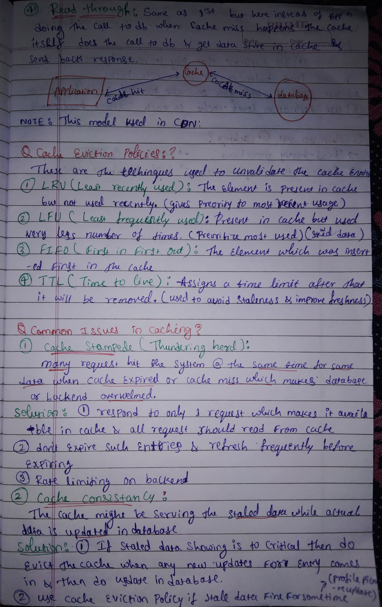 
  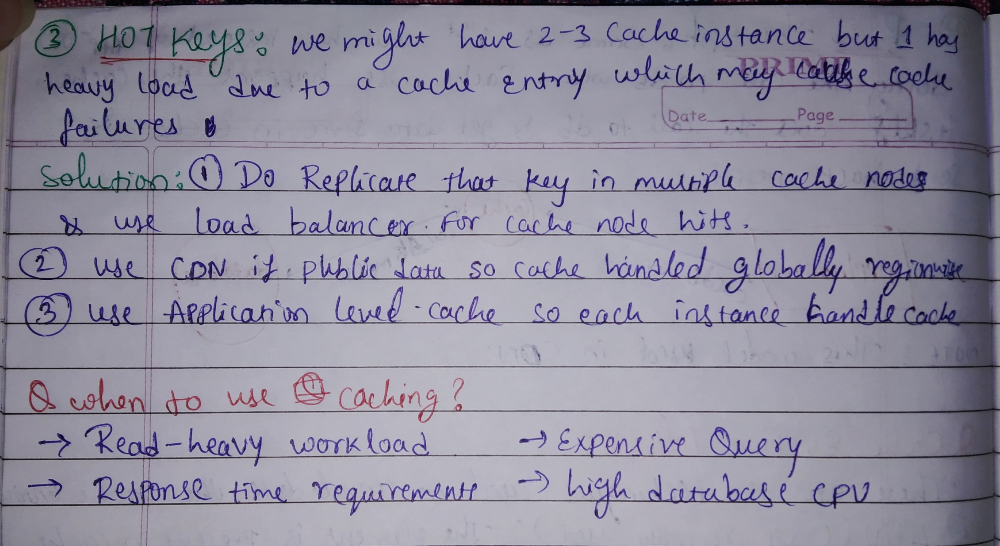

---

## 📚 Table of Contents
1. [What Is a Cache?](#1-what-is-a-cache)
2. [Where to Cache? (Strategies)](#2-where-to-cache-strategies)
   - [External Caching](#21-external-caching)
   - [In-Process Caching](#22-in-process-caching)
   - [Content Delivery Networks (CDN)](#23-content-delivery-networks-cdn)
   - [Client-Side Caching](#24-client-side-caching)
3. [Cache Access Patterns / Architectures](#3-cache-access-patterns--architectures)
   - [Cache Aside](#31-cache-aside)
   - [Write-Through](#32-write-through)
   - [Write-Back (Write-Behind)](#33-write-back-write-behind)
   - [Read-Through](#34-read-through)
4. [Cache Eviction Policies](#4-cache-eviction-policies)
5. [Common Caching Issues & Fixes](#5-common-caching-issues--fixes)
   - [Cache Stampede (Thundering Herd)](#51-cache-stampede-thundering-herd)
   - [Cache Consistency](#52-cache-consistency)
   - [Hot Keys](#53-hot-keys)
6. [When to Use Caching](#6-when-to-use-caching)

---

## 1. What Is a Cache? 💡

A **cache** is **temporary storage for recently accessed data** that lets us serve **future requests faster**, improving **latency** and **overall performance**.

> Think of it like keeping your most-used tools on your desk instead of in a box in the garage.

---

## 2. Where to Cache? (Strategies) 🗺️

### 2.1 External Caching

Caching is placed **outside** the application (e.g., Redis, Memcached).

**Flow:**
1. App checks cache.
2. If **miss**, fetch from DB.
3. Store result in cache.
4. Return response.

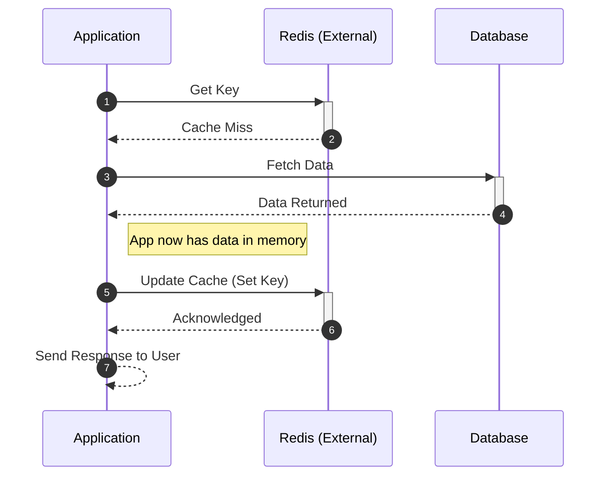

**Pros ✅**
- Shared across app instances.
- Can scale cache independently.

**Cons ❌**
- Extra network hop (slower than in-memory).

---

### 2.2 In-Process Caching (Local / In-Memory)

Each application instance maintains its **own cache in memory** (e.g., Guava cache, Caffeine, in-memory maps).

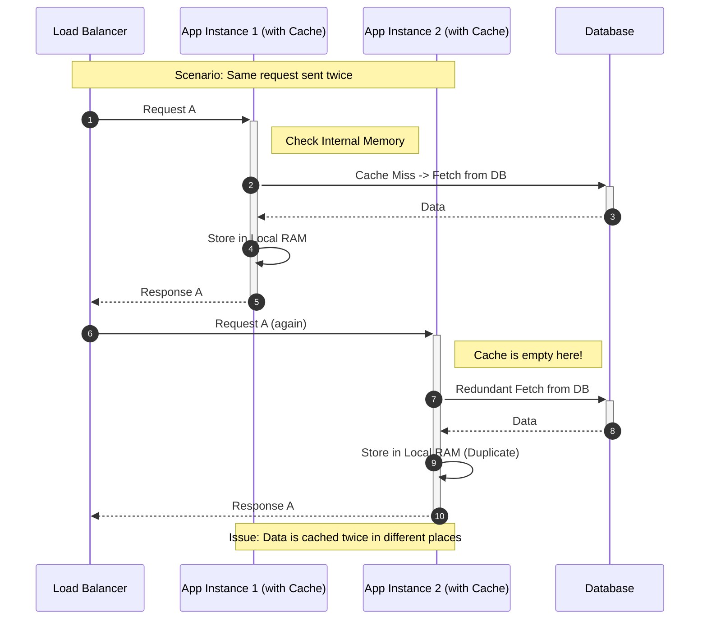

**Pros ✅**
- Ultra low latency (no network call).
- Very simple to implement.

**Cons ❌**
- Each instance has its **own copy** (duplicate data).
- Harder to keep data consistent across instances.

---

### 2.3 Content Delivery Networks (CDN)

A **CDN** stores **static content** (HTML, CSS, JS, images, videos, files) **near the user**, reducing **network latency**.

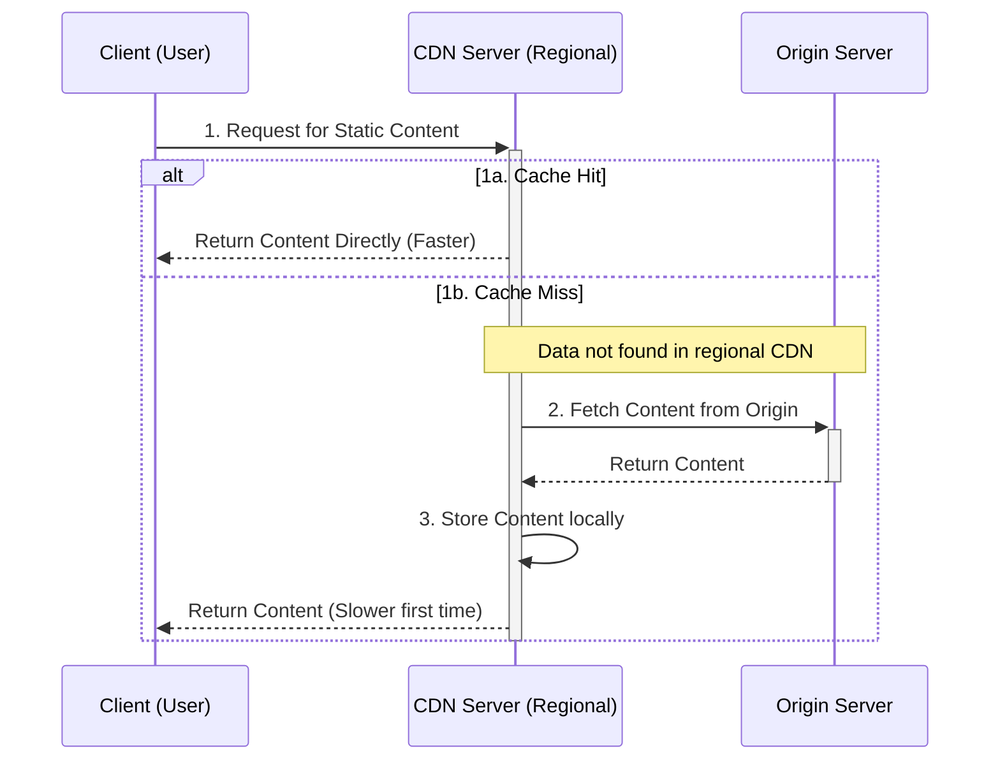

**Use cases 🌍**
- Public static assets.
- Global user base.

---

### 2.4 Client-Side Caching (Browser / App) 🧑‍💻

Content is cached **on the client device**, typically in the **browser cache** (disk or memory): images, CSS, HTML, files, etc.

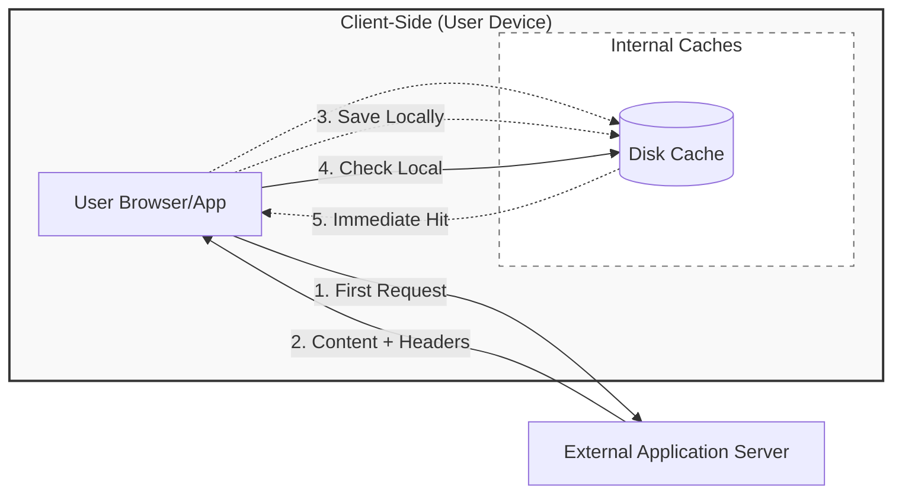

**Controlled by:**
- HTTP cache headers (`Cache-Control`, `ETag`, `Last-Modified`, etc.).

---

## 3. Cache Access Patterns / Architectures 🏗️

How the application interacts with cache + database.

### 3.1 Cache Aside (Lazy Loading) 🛋️

The application **controls the flow**:

1. Check cache.
2. If **hit** → return data.
3. If **miss** → load from DB, put into cache, return.

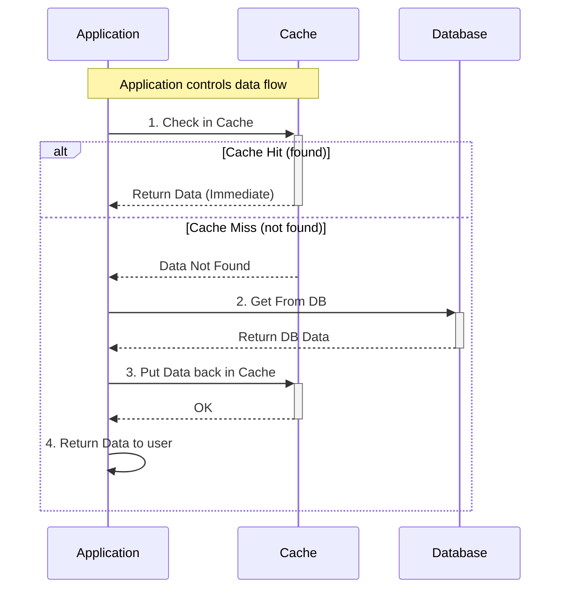

**Pros ✅**
- Cache only stores **actually used** data.
- Easy to reason about.

**Cons ❌**
- First request after a miss is **slow**.

---

### 3.2 Write-Through ✍️➡️💾

On writes/updates:

1. App **writes to cache**.
2. Cache **synchronously writes to DB**.

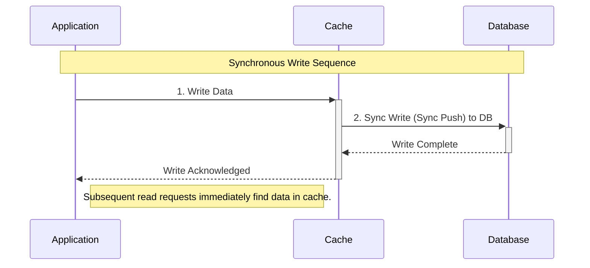

**Pros ✅**
- Cache and DB are **always in sync** (for successful writes).
- Reads are **always cacheable** immediately.

**Cons ❌**
- Slower writes (must hit both cache and DB).
- Still risk inconsistency if DB write fails but cache succeeds (must handle transactions / error handling carefully).

---

### 3.3 Write-Back (Write-Behind) ✍️➡️🕒

Similar to Write-Through, but **DB writes are async and batched**.

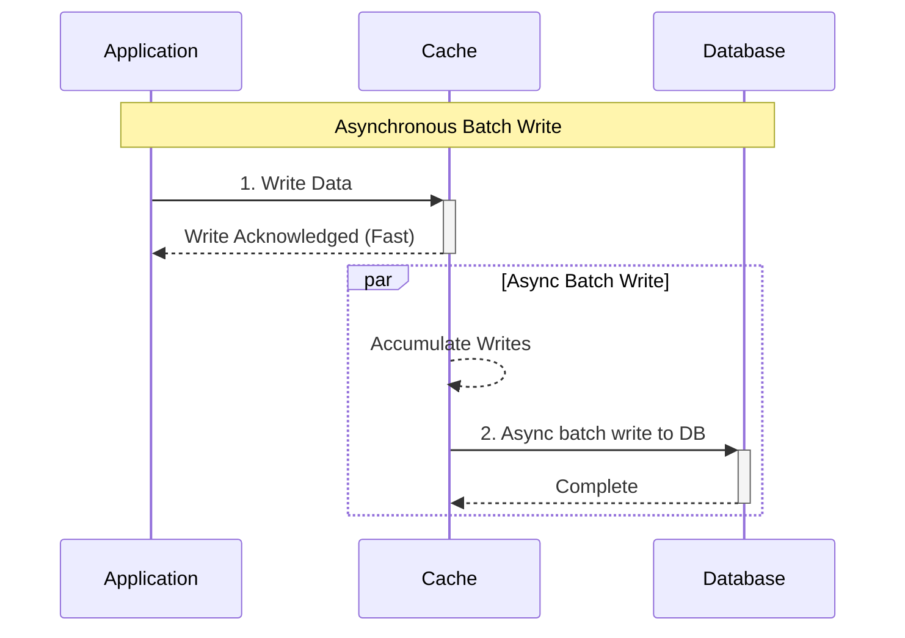

**Pros ✅**
- Very **fast** writes (app only waits for cache).
- Good for heavy write workloads.

**Cons ❌**
- Risk of **data loss** if cache fails before flushing to DB.
- More complex implementation.

---

### 3.4 Read-Through 👀➡️📚

The application **talks only to the cache**. On miss, the **cache itself** loads data from the DB, stores it, and returns it.

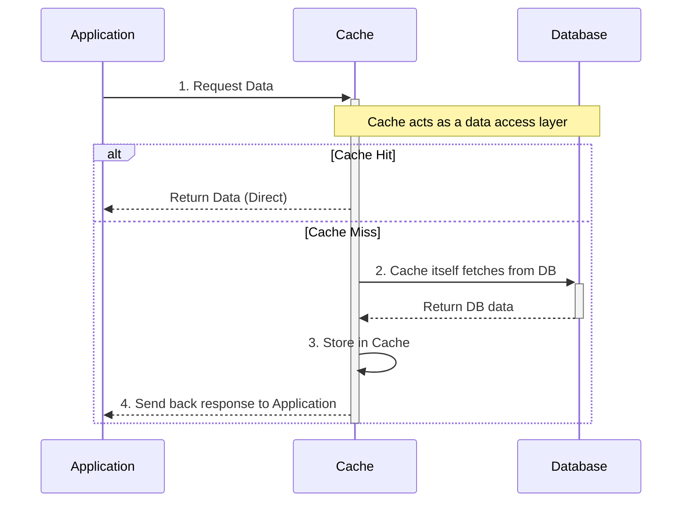

> **Common in CDNs** and some managed caching solutions.

**Pros ✅**
- Centralized logic for data loading.
- App code is simpler (only one endpoint: the cache).

**Cons ❌**
- Cache system becomes **more complex**.

---

## 4. Cache Eviction Policies 🧹

Strategies to **remove entries** from cache when space is needed or to avoid stale data.

1. **LRU (Least Recently Used)**
   - Evict the item that **has not been used for the longest time**.
   - Prioritizes **recently used** data.

2. **LFU (Least Frequently Used)**
   - Evict the item **used the fewest times**.
   - Good when you want to keep **popular (hot)** data.

3. **FIFO (First-In-First-Out)**
   - Evict the **earliest inserted** item first.
   - Simple, but ignores use frequency and recency.

4. **TTL (Time-to-Live)**
   - Each entry has an **expiry time**.
   - After TTL, item is invalidated/removed.
   - Helps avoid **stale data** and control freshness.

Often, systems **combine** these (e.g., LRU + TTL).

---

## 5. Common Caching Issues & Fixes 🚨

### 5.1 Cache Stampede (Thundering Herd)

Many requests hit the system at the **same time** for the **same data** when:
- The cache entry has **expired**, or
- There is a **cache miss** for a popular key.

This can overwhelm the DB or backend.

**Mitigations 🛡️**
1. **Request Coalescing / Single Flight**
   - Let **one** request recompute and fill the cache.
   - Other requests **wait** for that result instead of all hitting the DB.

2. **Pre-computation / Refresh Ahead**
   - Refresh popular keys **before** they expire.
   - Avoids synchronized expiry for hot keys.

3. **Rate Limiting / Backpressure**
   - Limit how many concurrent requests can hit the backend.

---

### 5.2 Cache Consistency

Cache may return **stale data** while DB has **newer data**.

**Mitigations 🛡️**
1. **Evict-on-Update (Invalidate Cache on Write)**
   - When data changes in DB, **evict the corresponding cache key**.
   - Next read will fetch fresh data from DB and repopulate cache.
   - Good when stale data is **not acceptable** (e.g., profile images, balances).

2. **Strict TTL / Short-Lived Entries**
   - Use **short TTL** where some staleness is acceptable.
   - Ensures data is periodically refreshed.

3. **Read-Your-Own-Writes Techniques** (pattern-level)
   - For critical flows, read from DB immediately after write, or bypass cache temporarily.

---

### 5.3 Hot Keys 🔥

A **single key** is accessed **very frequently**, overloading:
- A single cache node, or
- A shared cache cluster.

**Mitigations 🛡️**
1. **Replication + Load Balancing**
   - Replicate that key across **multiple cache nodes**.
   - Use a **load balancer** or client-side sharding to spread traffic.

2. **CDN for Public Data**
   - For public-facing content, use a **CDN** to spread load globally.

3. **Application-Level (In-Process) Cache**
   - Let each application instance keep its own copy.
   - Distributes read load across app instances.

---

## 6. When to Use Caching ✅

Use caching when you have:

- **Read-heavy workload** (many more reads than writes).
- **Strict response time (latency) requirements**.
- **Expensive queries/computations** (joins, aggregations, external API calls).
- **High database CPU utilization** and you want to offload reads.

> Rule of thumb: Cache **data that is read often, changes infrequently, and is expensive to recompute or fetch.**
