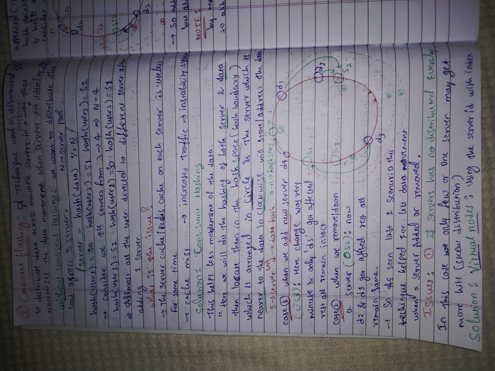
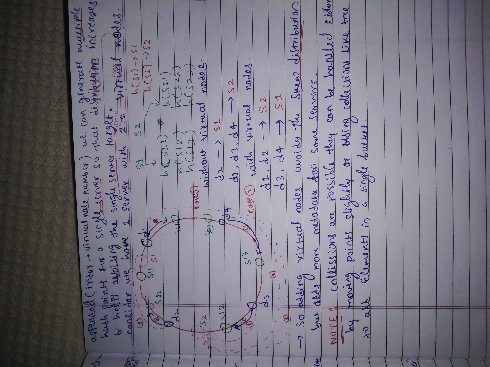
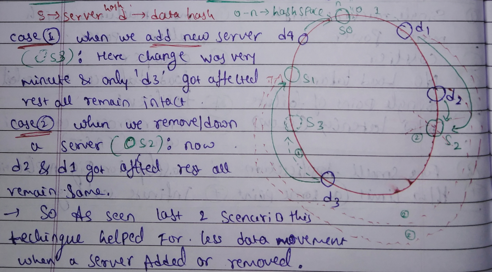
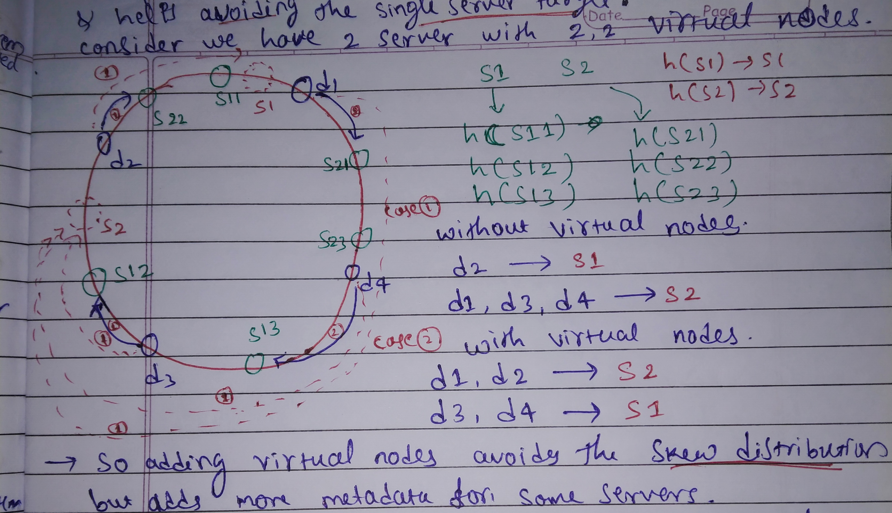

# 🌐 Consistent Hashing

Notes:

  

  

> Consistent Hashing is a distributed systems technique used to distribute data across multiple servers in a way that **minimizes data movement** when servers are added or removed.

---

## ❌ The Problem: Standard Hashing

In a traditional load-balancing setup, we use a simple modulo operation to find a server:

$$\text{server} = \text{hash}(\text{data}) \text{/}(N)$$

*(Where $N$ is the number of servers)*

### The Issue:

When $N$ changes (a server is added or crashes/removed), the entire mapping changes.

- **Result:** Almost all keys are reshuffled to different servers.
- **Impact:**
  - Massive **cache misses**
  - High traffic to the origin database
  - System instability

---

## ✅ The Solution: Consistent Hashing

Instead of a linear array, we use a **hash space** arranged in a **circle** (often called the *hash ring*).

  

### How it Works

1. **Hash servers:** Map servers onto the ring using their IP or ID.
2. **Hash data:** Map data keys onto the same ring.
3. **Assignment:** To find the server for a data point, move **clockwise** on the ring until you hit the first server.

### 🔄 Scenarios

- **Add a server:** Only the keys between the new server and its predecessor (counter-clockwise) need to move.
- **Remove a server:** Only the keys that were stored on the removed server move to the next one clockwise.

---

## ⚖️ The "Skew" Problem & Virtual Nodes

**The Problem:** If servers are not distributed evenly on the ring, one server might end up handling a disproportionate amount of data (**skewed distribution**).

**The Solution – Virtual Nodes 🎭**  
Instead of placing a server once on the ring, we place it multiple times using *virtual nodes* (e.g., `S11`, `S12`, `S13`).

  

### Benefits:

- **Balanced load:** More points on the ring lead to a more uniform distribution.
- **Avoids hotspots:** If one physical server is more powerful, we can assign it more virtual nodes to handle more load.

| Feature          | Standard Hashing | Consistent Hashing | With Virtual Nodes |
|------------------|------------------|--------------------|--------------------|
| **Data movement**| ⚠️ High          | ✅ Low             | ✅ Low             |
| **Load balance** | ❌ Poor          | ⚠️ Moderate        | ✅ Excellent       |
| **Metadata**     | 📉 Minimal       | 📈 Moderate        | 📊 Higher          |

---

## 📝 Key Takeaways

- **Clockwise rule:** Data is always stored on the first server encountered moving clockwise on the ring.
- **Minimal disruption:** On average, only about $1/N$ of the keys need to be remapped when servers are added or removed.
- **Collision handling:** Handled by slightly moving points or using collections (like trees) in a single bucket.

---

