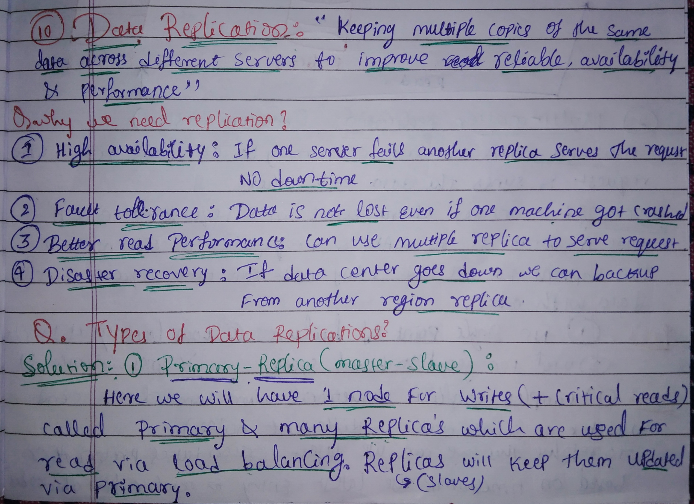
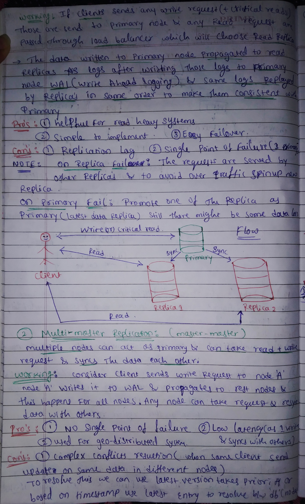
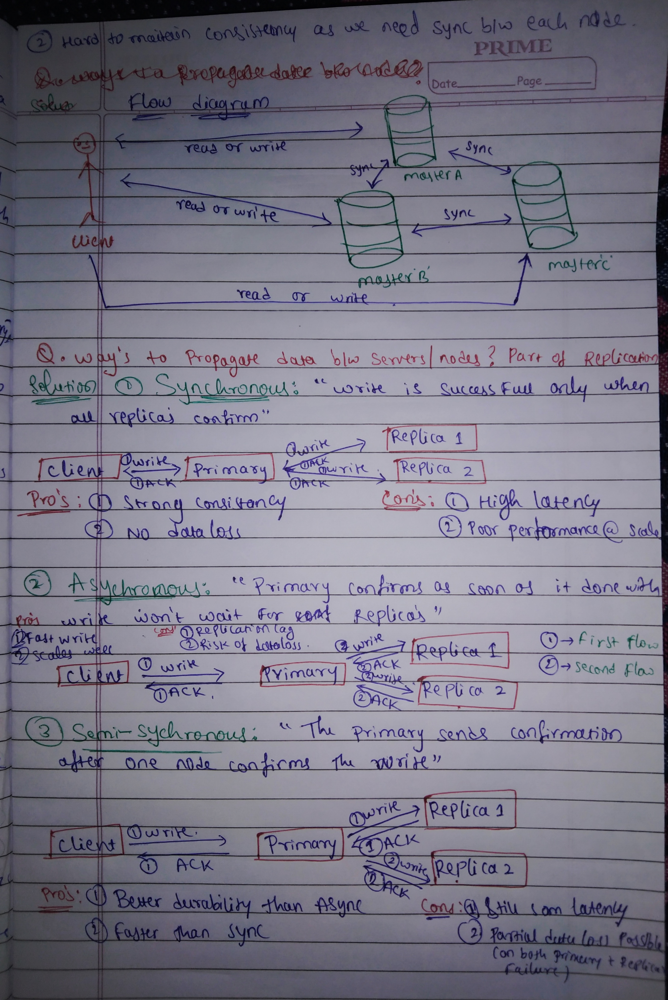
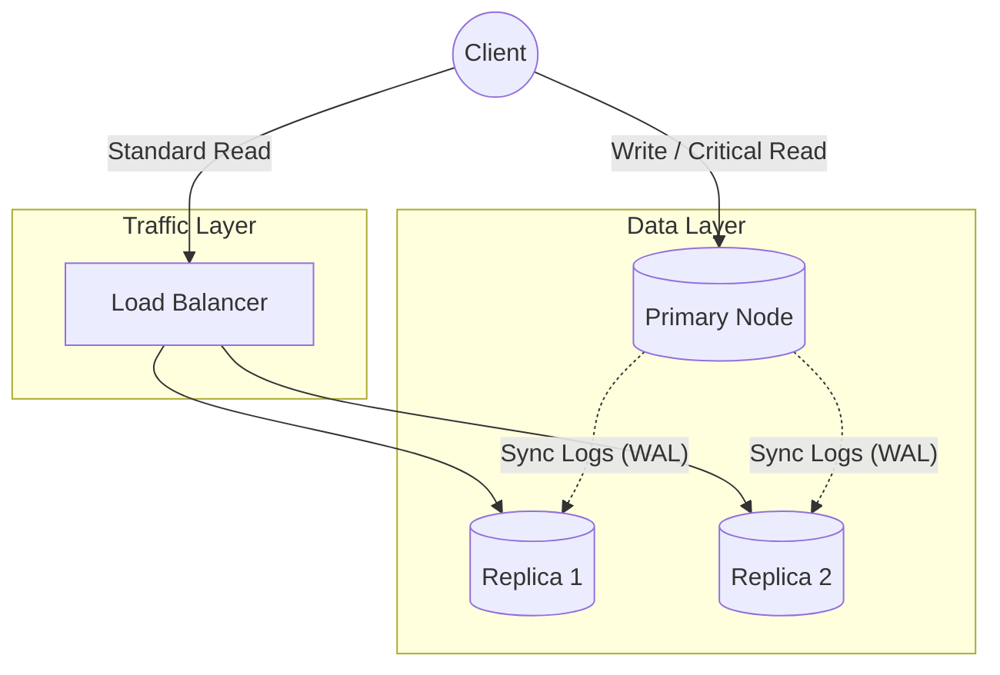
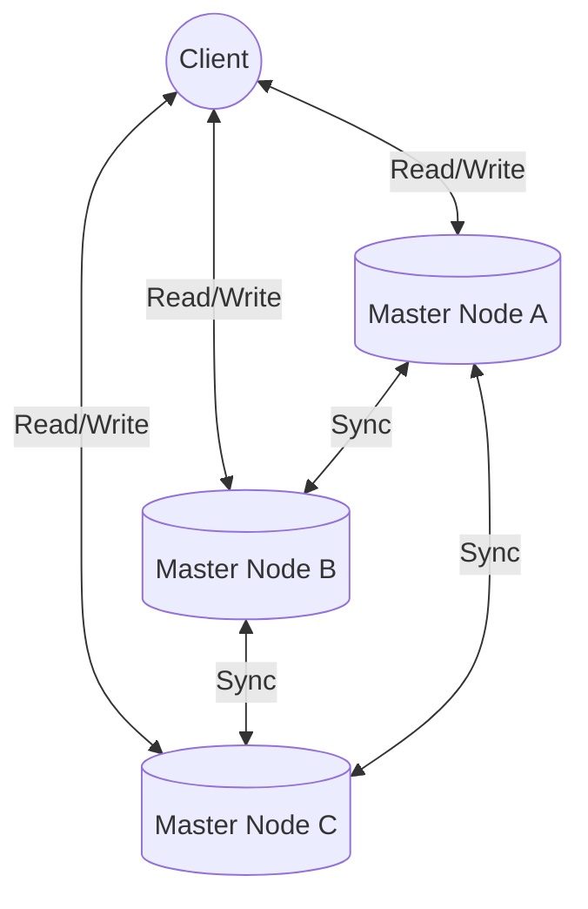
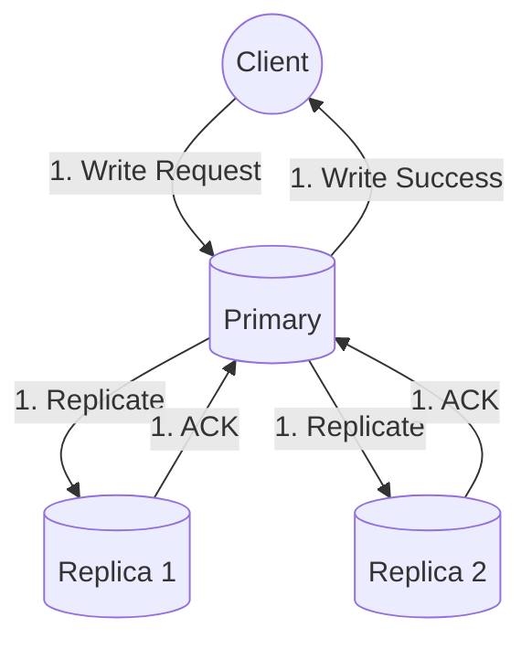
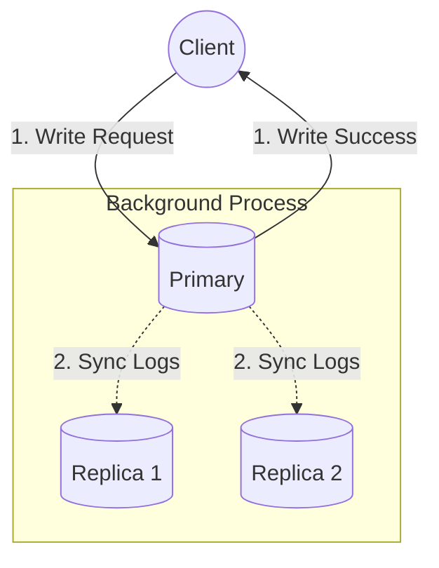
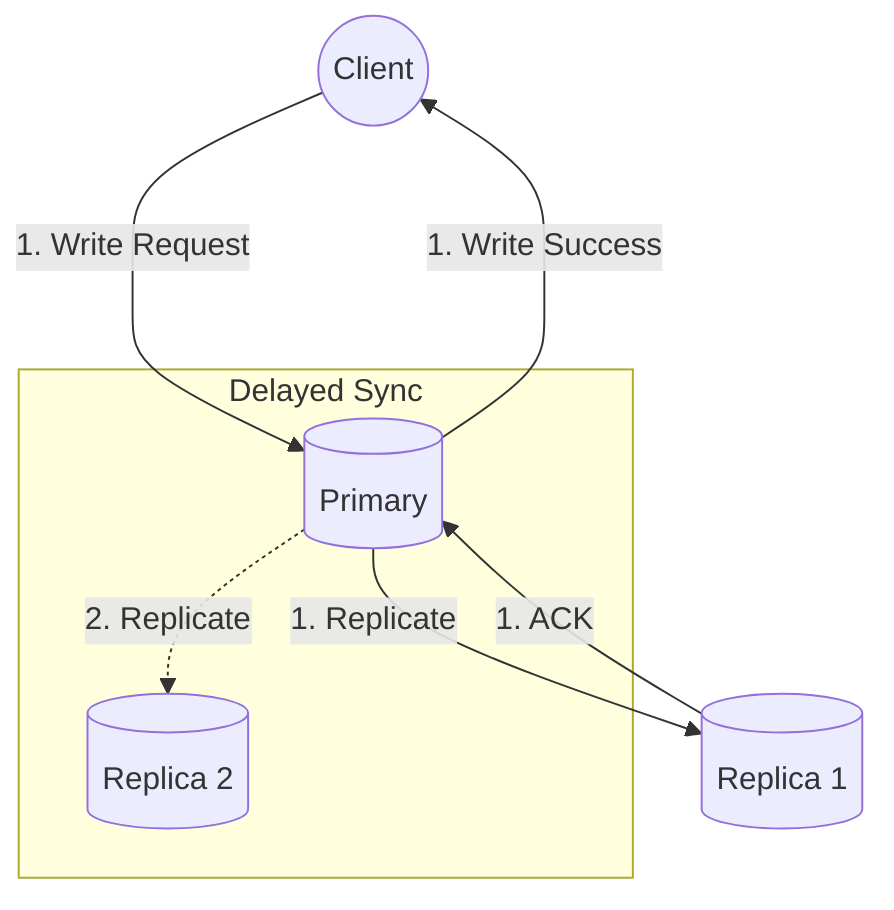
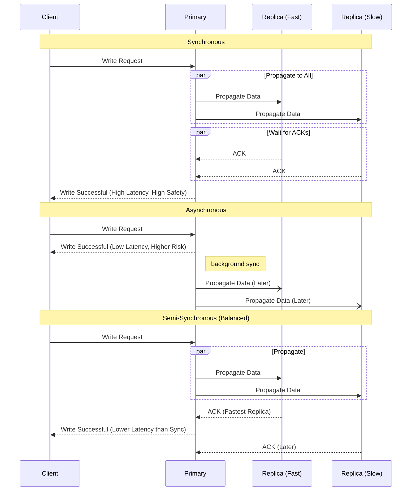

# 🌐 Data Replication

Notes:

  </img> 
  </img> 
  </img>

Data replication is the process of keeping multiple copies of the same data across different servers. This ensures the system remains reliable, fast, and available even if some components fail.
---

## 🧭 At a Glance

- 🔁 **Idea:** Keep multiple copies of the same data on different machines.
- 🎯 **Goals:** High availability, fault tolerance, faster reads, and disaster recovery.
- 🧱 **Patterns:** Primary–Replica (Master–Slave) and Multi–Master (Master–Master).
- ⚖️ **Sync Modes:** Synchronous, Asynchronous, and Semi–Synchronous replication.

## 📚 Table of Contents

- [🚀 Why do we need Replication?](#why-replication)
- [🛠 Types of Data Replication](#types-of-data-replication)
  - 1️⃣ [Primary-Replica (Master-Slave)](#primary-replica)
  - 2️⃣ [Multi-Master Replication (Master-Master)](#multi-master)
- [⚡ Ways to Propagate Data](#ways-to-propagate-data)
  - ⏱️ [Synchronous Replication](#synchronous-replication)
  - 🏎️ [Asynchronous Replication](#asynchronous-replication)
  - ⚖️ [Semi-Synchronous Replication](#semi-synchronous-replication)
- [📊 Comparison Flow of different kinds of synchronization](#comparison-sync-flow)

---

## 🚀 Why do we need Replication? 

* **High Availability:** If one server fails, another replica can serve the request, ensuring zero downtime.
* **Fault Tolerance:** Data is not lost even if a machine crashes.
* **Better Read Performance:** Multiple replicas can be used to serve read requests simultaneously.
* **Disaster Recovery:** If a whole data center goes down, we can failover to a replica in another region.

---

## 🛠 Types of Data Replication 

### 1. Primary-Replica (Master-Slave) 👑 

In this model, one node is designated as the **Primary** for all write operations, while **Replica** nodes handle the read traffic.

**How it works:**

1. Clients send all **Writes** (and critical reads) to the Primary node.
2. **Read** requests are distributed among Replicas via a **Load Balancer**.
3. The Primary node logs the data changes to a **Write-Ahead Log (WAL)**.
4. Replicas replay these logs in the same order to stay consistent.

| **Pros** ✅ | **Cons** ❌ |
| :--- | :--- |
| Excellent for read-heavy systems | Replication Lag (Delay) |
| Simple to implement | Single point of failure (Primary) |
| Easy failover for replicas | Potential data loss during primary failover |

> 💡 **Note**
>
> * 🧩 **On Replica Failure:** Requests are served by other replicas; a new replica is spun up to handle traffic.
> * 🏆 **On Primary Failure:** One replica is promoted to Primary (the one with the latest data).

---

### 2. Multi-Master Replication (Master-Master) 👑👑 

Multiple nodes act as Primary nodes. Any node can accept a write request and then synchronize with the others.

**How it works:**

* A client sends a write to **Node A**.
* Node A writes to its WAL and propagates the change to all other nodes.
* All nodes eventually sync to have the same data.

| **Pros** ✅ | **Cons** ❌ |
| :--- | :--- |
| No single point of failure | Extremely complex conflict resolution |
| Low latency for geo-distributed systems | Hard to maintain strict consistency |

> ⚠️ **Conflict Resolution:** To resolve concurrent updates, systems often use **Last Version Wins (LWW)** based on timestamps or unique DB node priorities.

---

## ⚡ Ways to Propagate Data 

How data moves from the Primary to the Replicas defines the balance between speed and safety.

### 1. Synchronous Replication ⏱️ 

The write is successful only when **all** replicas confirm they have received and written the data.

* **Pros:** Strong consistency, no data loss.
* **Cons:** High latency, poor performance at scale.

### 2. Asynchronous Replication 🏎️ 

The Primary confirms the write to the client immediately after writing it locally, without waiting for replicas.

* **Pros:** Fast writes, scales very well.
* **Cons:** Risk of data loss if Primary fails before syncing; replication lag.

### 3. Semi-Synchronous Replication ⚖️ 

The Primary waits for at least **one** replica to acknowledge the write before confirming to the client.

* **Pros:** Better durability than Async, faster than full Sync.
* **Cons:** Still some latency; partial data loss is possible if both Primary and the synced replica fail simultaneously.

---

### 📊 Comparison Flow of different kinds of synchronization 

