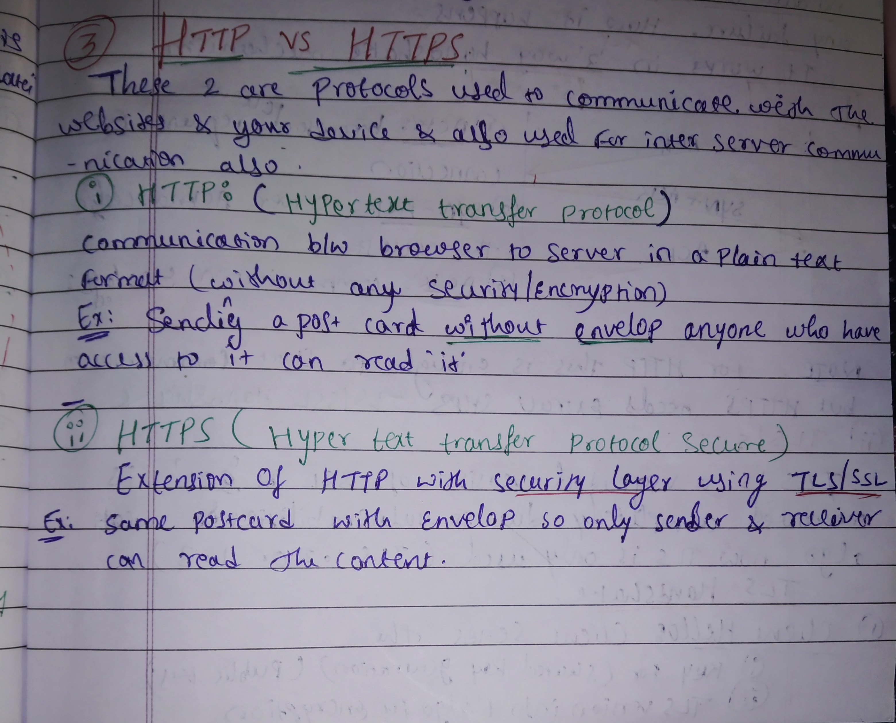
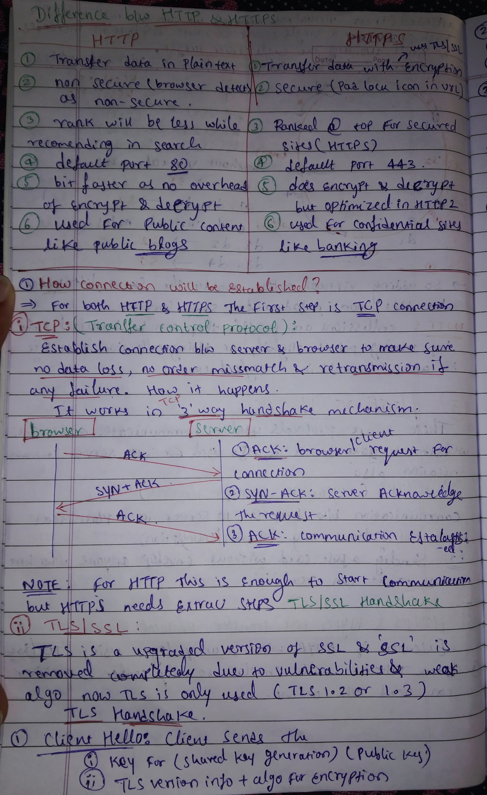
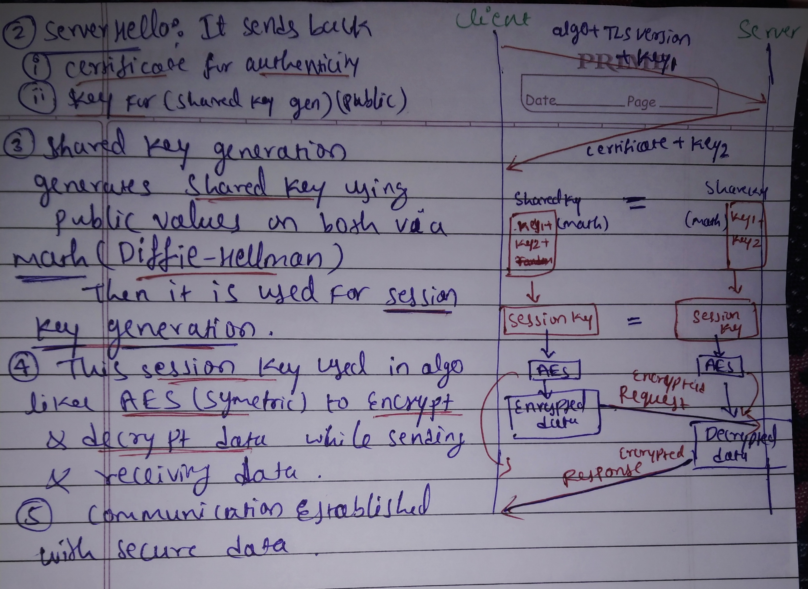
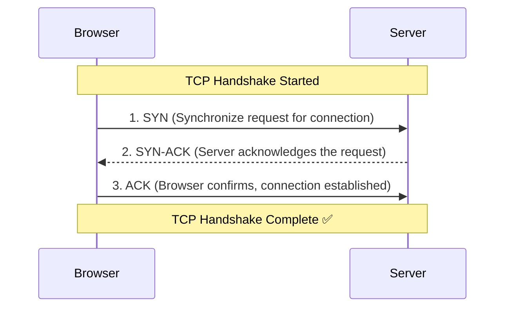
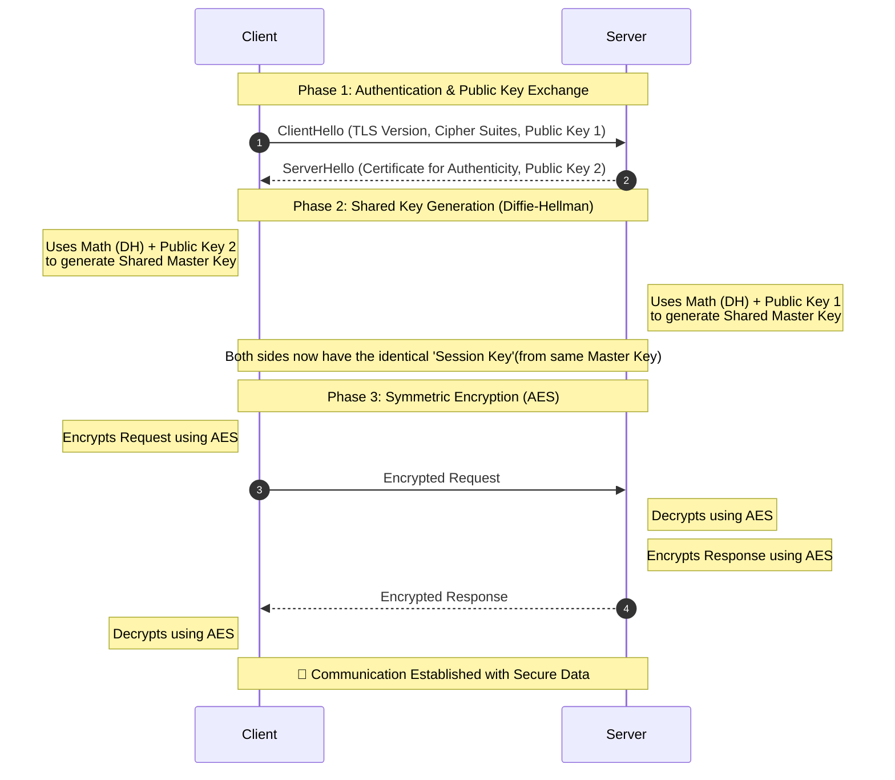

# 🌐 Understanding HTTP & HTTPS

Notes:

   
   
   

---

## 📌 Table of Contents
1.  **[Introduction to Protocols](#1-introduction-to-protocols)**
2.  **[Comparison: HTTP vs. HTTPS](#2-comparison-http-vs-https)**
3.  **[How a Connection Is Established](#3-how-a-connection-is-established)**
    * [Step 1: The TCP 3-Way Handshake](#step-1-the-tcp-3-way-handshake)
    * [Step 2: The TLS/SSL Handshake (HTTPS Only)](#step-2-the-tlsssl-handshake-https-only)

---

## 1. Introduction to Protocols 📨

These two protocols are the standard for communication between websites and your device. They are also widely used for communication between different servers (inter-server communication).

| Protocol | Full Name | Primary Characteristic | Analogy |
| :--- | :--- | :--- | :--- |
| **HTTP** | HyperText Transfer Protocol | Communicates from browser to server in **plain text**. No security/encryption. | Sending a postcard without an envelope; anyone who sees it can read the contents. 💌 |
| **HTTPS** | HyperText Transfer Protocol **Secure** | An extension of HTTP with a security layer, utilizing **TLS/SSL**. | The same postcard but inside a **sealed envelope**, so only sender and receiver can read it. ✉️ |

---

## 2. Comparison: HTTP vs. HTTPS ⚔️

A head-to-head comparison of key attributes:

| Feature | HTTP | HTTPS (uses TLS/SSL) |
| :--- | :---: | :---: |
| **Data Transfer** | Plain Text | **Encrypted** 🔐 |
| **Security Status** | Non-Secure (Browsers display a warning) ⚠️ | **Secure** (Browsers display a padlock icon in URL) 🔒 |
| **Search Ranking** | Lower rank in search recommendations | **Ranked higher**; search engines prioritize secured sites 📈 |
| **Default Port** | **80** | **443** |
| **Performance** | Slightly faster (no encryption/decryption overhead) 🚀 | Initially slower, but optimized in HTTP/2 ⚙️ |
| **Typical Use Case** | Public content (blogs, documentation) 📰 | Confidential/transactional sites (banking, logins, payments) 🏦 |

---

## 3. How a Connection Is Established 🔗

Regardless of which protocol is used, the first prerequisite is establishing a **reliable connection via TCP**.

For both HTTP and HTTPS:
1. ✅ Establish a TCP connection (3-way handshake)
2. 🔁 For **HTTP**: start sending/receiving data immediately
3. 🔐 For **HTTPS**: perform an additional **TLS handshake** on top of TCP, then start secure data transfer

---

### Step 1: The TCP 3-Way Handshake 🤝

**TCP (Transmission Control Protocol)** establishes a connection between the client (browser) and the server. This ensures:
- No data is lost
- No order mismatch
- Retransmission occurs in case of failure

This process is known as the **3-way handshake mechanism**.

#### 🧭 Process Flow

> ℹ️ For **standard HTTP**, this 3-way handshake is sufficient to start communication.
> 
> For **HTTPS**, an additional **TLS/SSL handshake** runs **after** this step to provide security.

---

### Step 2: The TLS/SSL Handshake (HTTPS Only) 🔒

This step provides the **security layer**.

- **SSL** was the original protocol
- **TLS (Transport Layer Security)** is the modern, upgraded version
- SSL is now considered insecure and deprecated
- Modern systems use **TLS 1.2** or **TLS 1.3**

The TLS handshake is responsible for:
- 🔐 Authenticating the server (and optionally the client)
- 🔑 Securely agreeing on a **shared secret** (master key)
- 🧩 Deriving a **session key** used for fast symmetric encryption (e.g., AES)

### TLS Handshake – Step-by-Step 🧩

Here’s the same flow written out as clear steps:

1. **ClientHello 🚀**  
   The **client** starts the TLS handshake:
   - Sends supported **TLS version**
   - Sends supported **cipher suites** (encryption algorithms)
   - Sends a **public key1** used later in key generation

2. **ServerHello 📬**  
   The **server** responds:
   - Chooses a **TLS version** and **cipher suite** from the client’s list
   - Sends back its **digital certificate** (proves identity via CA)
   - Sends its own **public key2** (and key exchange parameters / public key, depending on the key exchange method)

3. **Shared Master Key Generation 🔑**  
   Both sides independently compute the **same shared master key**:
   - Client uses its **secret** + server’s **public values** (e.g., Diffie–Hellman)  
   - Server uses its **secret** + client’s **public values**  
   - Result: both now hold an identical **master key** (never sent over the wire)

4. **Session Key Derivation & Encrypted Session 🔐**  
   From the master key, both sides derive one or more **session keys**:
   - Client derives a **Session Key** and switches to **encrypted mode**
   - Server derives the **same Session Key** and switches to **encrypted mode**
   - From now on, all application data is **symmetrically encrypted** (e.g., with **AES**)

5. **Secure Data Exchange 🔄**  
   Encrypted communication begins:
   - Client ➡️ Server: **Encrypted Request** (e.g., HTTP request body + headers, depending on TLS version)  
   - Server 🔍: **Decrypts**, processes the request, prepares response  
   - Server ➡️ Client: **Encrypted Response**  
   - Client 🔓: **Decrypts** the response using the same Session Key

6. **Secure Channel Established ✅**  
   At this point:
   - Integrity 🧱: Data can’t be modified without detection
   - Confidentiality 🕵️: Eavesdroppers see only ciphertext
   - Authenticity 🧾: Client trusts it’s talking to the right server (based on the certificate)

