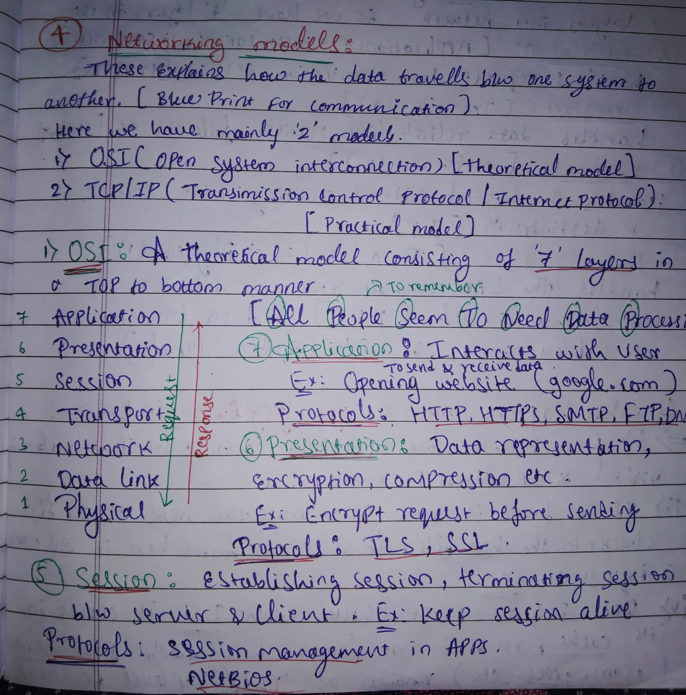
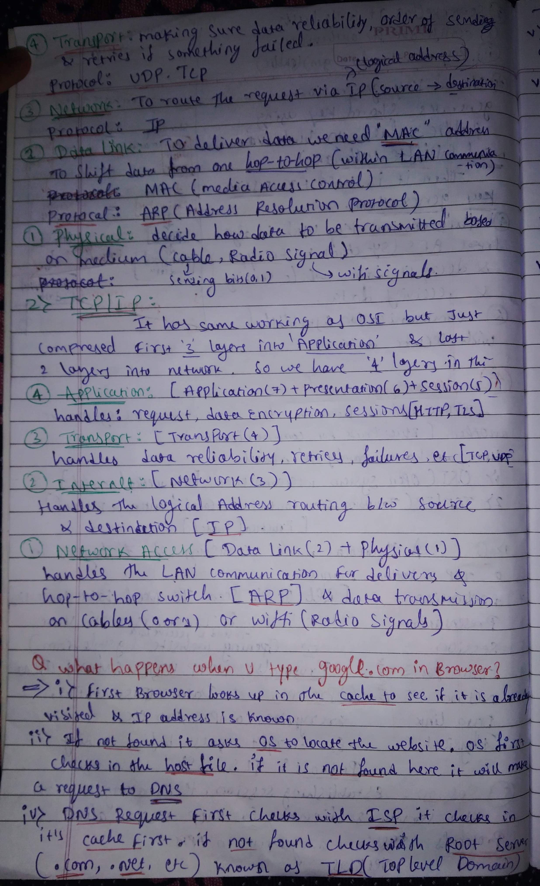
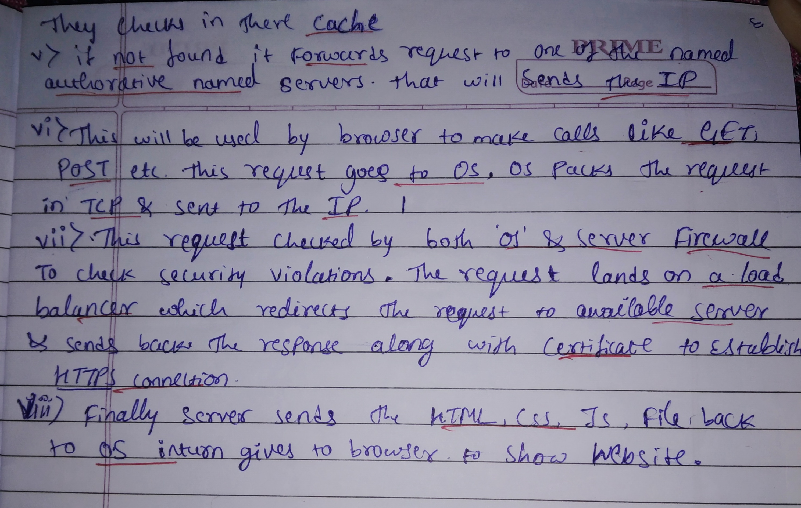

# 🌐 Introduction to Computer Networking Models & The Web Request Journey
Notes:

   
   
   

---

## 📚 Table of Contents

1. [🌍 Networking Models Overview](#-networking-models-overview)
2. [📡 The OSI Model Deep Dive](#1-the-osi-model-deep-dive)
3. [🌐 The TCP/IP Model Breakdown](#-the-tcpip-model-breakdown)
4. [⚖️ Comparison: OSI vs. TCP/IP](#-comparison-osi-vs-tcpip)
5. [❓ Q&A: What Happens When You Type google.com in a Browser?](#-q-what-happens-when-you-type-httpswwwgooglecom-in-a-browser)

---

## 🌍 Networking Models Overview

These models explain how data travels between one system to another. Think of them as the **blueprint for communication**.

There are mainly two widely recognized models:

| 🧩 Model | 🧠 Type | 📛 Full Name |
| :------ | :------ | :----------- |
| **OSI** | Theoretical Model | Open Systems Interconnection |
| **TCP/IP** | Practical Model | Transmission Control Protocol / Internet Protocol |

---

## 1️⃣ The OSI Model Deep Dive

A theoretical, **top-to-bottom** model consisting of **7 layers**.

### 🧠 Mnemonic to Remember the Layers (Top → Bottom)

> **A**ll **P**eople **S**eem **T**o **N**eed **D**ata **P**rocessing
>
> Application → Presentation → Session → Transport → Network → Data Link → Physical

---

### 7️⃣ Application Layer

- **Purpose:** Interacts with the user to send & receive data.
- **Example:** Opening a website like `google.com`.
- **Common Protocols:** `HTTP`, `HTTPS`, `SMTP`, `FTP`, `DNS`

---

### 6️⃣ Presentation Layer

- **Purpose:** Handles data representation, **encryption**, and **compression**.
- **Example:** Encrypting a request before it is sent.
- **Common Protocols:** `TLS`, `SSL`

---

### 5️⃣ Session Layer

- **Purpose:** Establishing, managing, and terminating **sessions** between a server and a client.
- **Example:** Keeping a user session alive while they're logged into a website.
- **Common Protocols / Concepts:** Session management in apps, `NETBIOS`

---

### 4️⃣ Transport Layer

- **Purpose:** Responsible for **data reliability**, **ordering**, and **retries** if something fails.
- **Common Protocols:** `TCP`, `UDP`

---

### 3️⃣ Network Layer

- **Purpose:** Routes the request via **IP (Logical Address)**. Handles `source → destination` routing.
- **Common Protocol:** `IP`

---

### 2️⃣ Data Link Layer

- **Purpose:** Delivers data **hop-to-hop** (within a LAN). Physically shifting data requires a **MAC address**.
- **Common Protocols / Concepts:**
  - `MAC` (Media Access Control)
  - `ARP` (Address Resolution Protocol)

---

### 1️⃣ Physical Layer

- **Purpose:** Decides **how** data is transmitted based on the **physical medium**.
- **Examples:** `Cable` (Ethernet), `Radio signals` (WiFi signals).
- **Operation:** Sending bits (`0`, `1`), Wi-Fi signals, electrical/optical pulses.

---

## ⚖️ Comparison: OSI vs TCP/IP

The **TCP/IP model** has the same basic working principles as the OSI model but uses a more **compressed structure**, mapping the 7 OSI layers into just **4 layers**.

- It compresses the **first 3 layers** (Application, Presentation, Session) into a single **Application** layer.
- It compresses the **last 2 layers** (Data Link, Physical) into a single **Network Access** layer.

| 🧱 OSI Layer      | 🌐 TCP/IP Layer (mapping) |
| :--------------- | :------------------------ |
| Application (7)  | **1. Application**        |
| Presentation (6) | **1. Application**        |
| Session (5)      | **1. Application**        |
| Transport (4)    | **2. Transport**          |
| Network (3)      | **3. Internet**           |
| Data Link (2)    | **4. Network Access**     |
| Physical (1)     | **4. Network Access**     |

---

## 🌐 The TCP/IP Model Breakdown

_(Often how networking is implemented in practice.)_

### 4️⃣ Application Layer

- **Maps to:** OSI Application (7) + Presentation (6) + Session (5)
- **Handles:**
  - Requests & responses
  - Data representation & encryption
  - Session management
- **Example Protocols:** `HTTP`, `HTTPS`, `TLS`, `FTP`, `SMTP`, `DNS`

---

### 3️⃣ Transport Layer

- **Maps to:** OSI Transport (4)
- **Handles:**
  - Reliable delivery (or best-effort)
  - Retries, acknowledgements (ACKs)
  - Flow control & congestion control
- **Example Protocols:** `TCP`, `UDP`

---

### 2️⃣ Internet Layer

- **Maps to:** OSI Network (3)
- **Handles:**
  - Logical addressing (`IP` addresses)
  - Routing packets from **source → destination** across networks
- **Example Protocol:** `IP` (IPv4, IPv6)

---

### 1️⃣ Network Access Layer

- **Maps to:** OSI Data Link (2) + Physical (1)
- **Handles:**
  - LAN communication
  - Hop-to-hop delivery between devices (switches, routers)
  - Actual data transmission over the physical medium
- **Examples:** Ethernet, WiFi
- **Example Protocol / Concept:** `ARP`

---

## ❓ Q: What Happens When You Type `https://www.google.com` in a Browser?

Let's walk through the high-level journey of your request 🌍➡️🌐➡️🖥️

### 1️⃣ Browser Cache Lookup

- The **browser** first checks its **own cache** to see if you've visited the site before.
- If it already knows the **IP address** for `www.google.com`, it can skip DNS.

---

### 2️⃣ OS & Hosts File Check

- If the IP is **not found** in the browser cache, the browser asks the **Operating System (OS)**.
- The OS checks its local **`hosts` file** (manual domain → IP mappings).

---

### 3️⃣ DNS Request Begins

If the domain is **not found** in the `hosts` file, the OS makes a request to the **DNS (Domain Name System)**.

DNS resolution usually goes through these steps:

1. Check your **ISP's DNS server cache**.
2. If not found, query the **Root DNS Servers**.
   - These know where to find the servers responsible for top-level domains like `.com`, `.net`, etc. (called **TLD servers**).
3. The **TLD servers** redirect/forward the request to an appropriate **Authoritative Name Server** for `google.com`.
4. The **Authoritative Name Server** returns the **correct IP address** for `www.google.com`.

This IP address is sent back to your OS and then to the browser.

---

### 4️⃣ Creating the HTTP(S) Request

- Now that the IP is known, the **browser** creates an **HTTP/HTTPS request** (e.g., `GET /` for the homepage).
- This request is passed to the **OS**.
- The **OS** packs this data into a **TCP segment**, which then becomes part of an **IP packet**.

---

### 5️⃣ Network & Firewalls

- The packet leaves your machine and travels through routers and switches to reach the destination.
- Along the way, and on the server side:
  - The **OS firewall** on your machine may filter outgoing/return traffic.
  - The **destination server's firewall** also checks incoming traffic for security violations.

---

### 6️⃣ Load Balancer & Backend Server

- The request typically first hits a **Load Balancer**.
  - It checks which backend servers are **healthy** and **available**.
  - It forwards your request to one of these backend servers.
- The backend server processes your request and prepares an **HTTP response**.

For **HTTPS**:

- The server also sends its **TLS/SSL certificate**.
- A **secure TLS handshake** occurs to establish an encrypted connection.

---

### 7️⃣ Response: HTML, CSS, JS Back to You

- The server sends back:
  - `HTML` (structure of the page)
  - `CSS` (styling)
  - `JS` (interactivity)
- These packets travel back through the network to your **OS**, and then to your **browser**.
- The **browser** parses the HTML, downloads additional resources (images, fonts, scripts), executes JavaScript, and finally **renders the webpage** you see.

---

