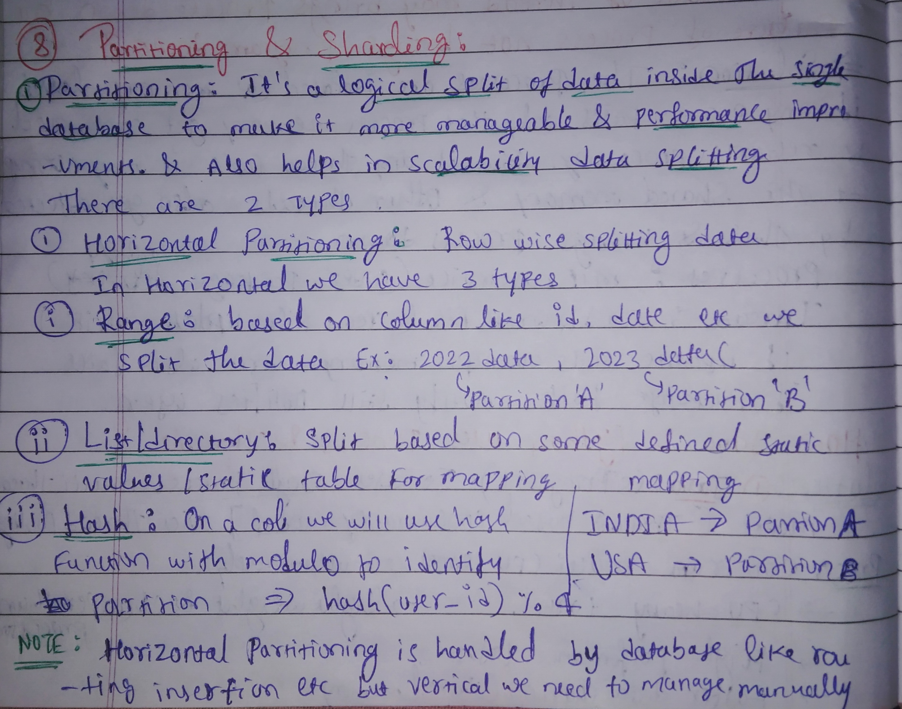
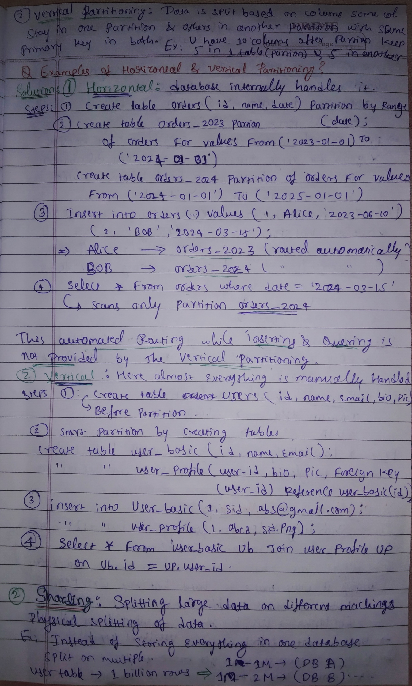
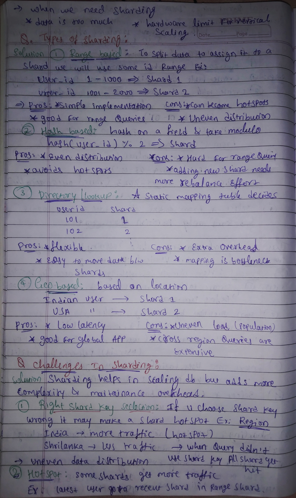
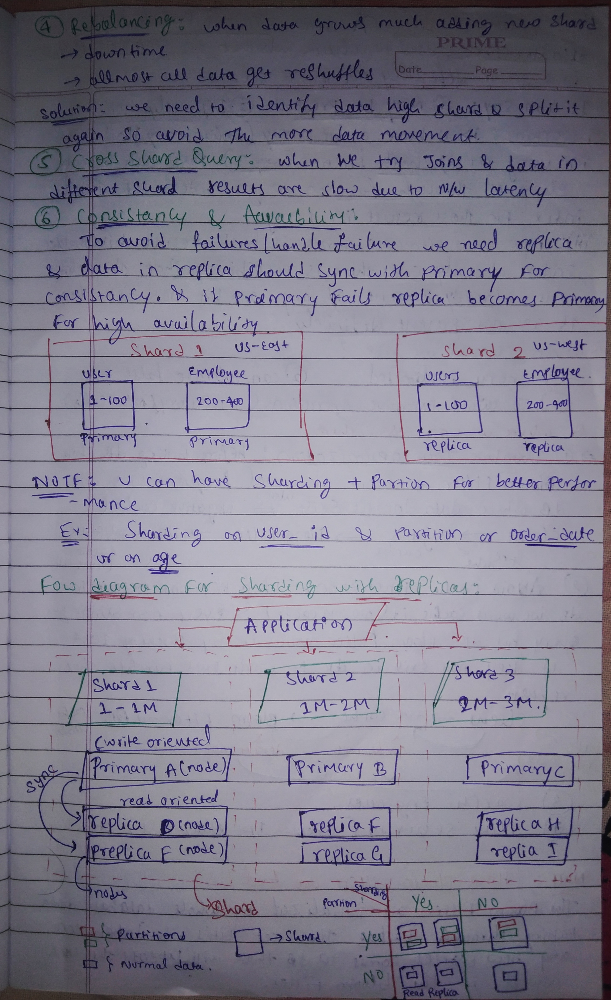
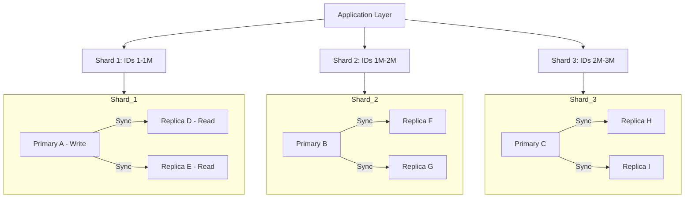

# 📂 Database Scaling: Partitioning & Sharding

## 📝 Notes

<p align="center">
  </img><br>
  </img><br>
  </img><br>
  </img>
</p>

---

## 📚 Table of Contents

- [1️⃣ Database Partitioning](#1-database-partitioning)
  - [A. Horizontal Partitioning (Row-wise)](#a-horizontal-partitioning-row-wise)
  - [B. Vertical Partitioning (Column-wise)](#b-vertical-partitioning-column-wise)
- [2️⃣ Sharding](#2-sharding)
- [3️⃣ Sharding Challenges & Solutions](#3-sharding-challenges--solutions)
- [4️⃣ System Architecture Visualized](#4-system-architecture-visualized)
- [🛠️ Implementation Example (SQL)](#%EF%B8%8F-implementation-example-sql)

---

## 1. Database Partitioning
**Partitioning** is the logical split of data within a **single database** instance to make it more manageable, improve performance, and aid in scalability.

### A. Horizontal Partitioning (Row-wise)
Splitting a table into multiple tables with the same schema but fewer rows.
* **Range-based:** Based on a column like `ID` or `Date`.
    * *Ex:* 2022 data in Partition A, 2023 data in Partition B.
* **List/Directory:** Based on defined static values.
    * *Ex:* Country: India $\rightarrow$ Partition A, USA $\rightarrow$ Partition B.
* **Hash-based:** Uses a hash function (e.g., `hash(user_id) % 4`) to identify the partition.

> [!NOTE]
> Horizontal partitioning is often handled automatically by modern databases (routing insertion/queries).

### B. Vertical Partitioning (Column-wise)
Splitting data based on columns. Different columns stay in different partitions but share the same **Primary Key**.
* *Ex:* Move heavy/infrequent columns like `bio` or `profile_pic` to a separate table to keep the `user_basic` table lean.

---

## 2. Sharding
**Sharding** is the **physical splitting** of data across different machines (nodes). It is the go-to solution when a single server hits its hardware limits.

### Types of Sharding Strategies
| Strategy | Description | Pros | Cons |
| :--- | :--- | :--- | :--- |
| **Range Based** | Split by ID ranges (1-1k, 1k-2k) | Simple to implement | Can become hotspots |
| **Hash Based** | `hash(key) % N` | Even distribution | Hard for range queries |
| **Directory** | Static mapping table | Flexible data movement | Mapping table is a bottleneck |
| **Geo Based** | Based on user location | Low latency for global apps | Uneven load by region |

---

## 3. Sharding Challenges & Solutions
1.  🎯 **Right Shard Key Selection:** Choosing a poor key leads to **Hotspots** (e.g., a "Region" key where one country has 10x more traffic than others).
2.  🔀 **Rebalancing:** When data grows, adding new shards causes downtime and massive data reshuffling.
    * ✅ *Solution:* Identify high-load shards and split them specifically to minimize movement.
3.  🔗 **Cross-Shard Queries:** Joins across different shards are slow due to network latency.
4.  🛡️ **Consistency & Availability:** To avoid failure, use **Replicas**. Replicas must sync with the Primary for consistency.

---

## 4. System Architecture Visualized

### Sharding with Replicas Flow
This diagram illustrates how an application interacts with multiple shards, where each shard has a Primary node (Write-oriented) and multiple Replicas (Read-oriented).



### Hybrid Approach: Sharding + Partitioning
You can combine both for maximum performance. For example, shard physically by `user_id` and then partition logically within that shard by `order_date or creation_date`.

|                     | Partition: NO                             | Partition: YES                                        |
| :------------------ | :---------------------------------------- | :---------------------------------------------------- |
| **Sharding: NO**    | 🟦 Single DB / Standard Table             | 🟦 DB with 🟥 Partitions (Logically Split Table)      |
| **Sharding: YES**   | 🟦🟦 Sharded Nodes (No Partitions)         | 🟦🟦 Nodes with 🟥 Partitions (Sharded + Partitioned) |

**Legend**

- 🟦  = Single database / node (normal data)
- 🟦🟦 = Multiple databases / shards
- 🟥  = Partition inside a node

---

## 🛠️ Implementation Example (SQL)

### Horizontal Partitioning (Row-wise)

**1️⃣ INSERT Scenario – routing handled by the database**

```sql
-- Creating a parent table partitioned by range
CREATE TABLE orders (
    id INT,
    name VARCHAR(50),
    order_date DATE
) PARTITION BY RANGE (order_date);

-- Creating specific partitions
CREATE TABLE orders_2023 PARTITION OF orders
    FOR VALUES FROM ('2023-01-01') TO ('2024-01-01');

-- ✅ Database automatically routes this INSERT to the right partition (orders_2023)
INSERT INTO orders VALUES (1, 'Alice', '2023-06-10');
```

**2️⃣ SELECT Scenario – query routing also handled automatically**

```sql
-- You still query the logical parent table
SELECT id, name
FROM orders
WHERE order_date BETWEEN '2023-06-01' AND '2023-06-30';

-- ✅ The database engine internally checks only the relevant partitions
--    (e.g., orders_2023) based on the partitioning rules.
```

> ℹ️ With **horizontal partitioning**, the **DB engine** usually takes care of
> routing both **INSERT** and **SELECT** queries to the appropriate partitions.
> The application just hits the parent table as if it were a single table.

---

### Vertical Partitioning (Column-wise)

```sql
-- Split one logical entity into two tables (vertical partition)
CREATE TABLE user_basic (
    id INT PRIMARY KEY,
    name VARCHAR(50),
    email VARCHAR(50)
);

CREATE TABLE user_profile (
    user_id INT REFERENCES user_basic(id),
    bio TEXT,
    profile_pic BLOB
);
```

**1️⃣ INSERT Scenario – write to multiple tables**

```sql
-- Insert basic information
INSERT INTO user_basic (id, name, email)
VALUES (1, 'Alice', 'alice@example.com');

-- Insert less-frequent / heavy columns in another table
INSERT INTO user_profile (user_id, bio, profile_pic)
VALUES (1, 'Loves distributed systems', NULL);
```

**2️⃣ SELECT Scenario – manual JOIN needed to reconstruct the full row**

```sql
SELECT ub.id, ub.name, ub.email, up.bio, up.profile_pic
FROM user_basic AS ub
LEFT JOIN user_profile AS up
  ON ub.id = up.user_id
WHERE ub.id = 1;
```

> ⚠️ With **vertical partitioning**, the database does **not** magically
> stitch columns back together for you. The **application / query** must
> explicitly use **JOINs** when it needs data from both vertical slices.
