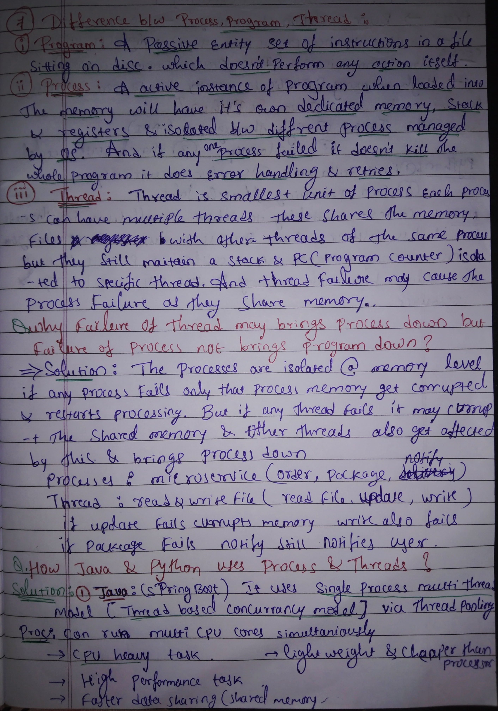
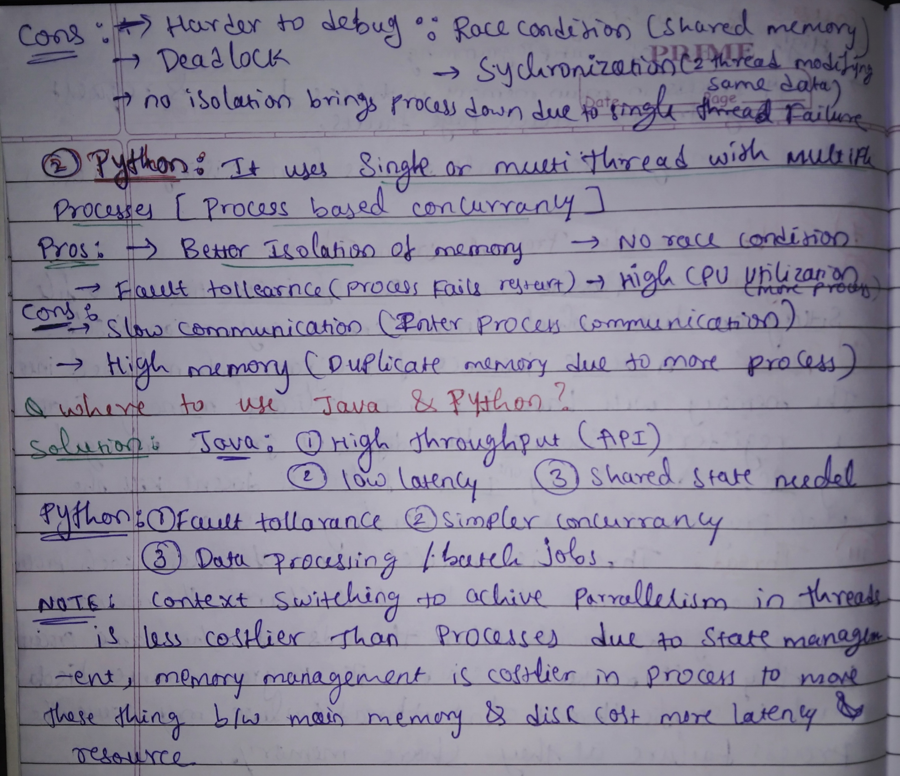
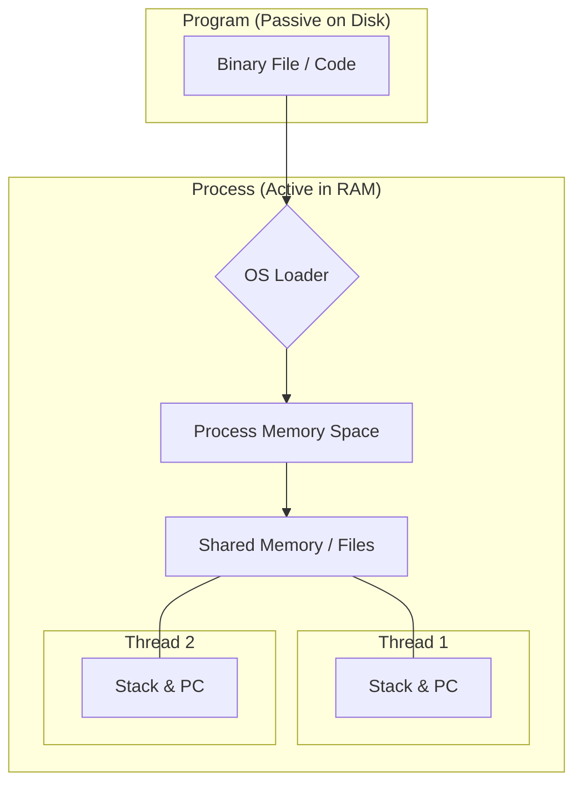

# 🚀 Program vs. Process vs. Thread

Notes:

  </img> 
  </img>

---

## 📚 Table of Contents

- [🏗️ Core Definitions](#-core-definitions)
- [📊 Visualizing the Hierarchy](#-visualizing-the-hierarchy)
- [🛡️ Failure & Isolation: The Big "Why"](#️-failure--isolation-the-big-why)
- [☕ Java Concurrency Model](#-java-concurrency-model)
- [🐍 Python Concurrency Model](#-python-concurrency-model)
- [🎯 Use Case Summary](#-use-case-summary)
- [📝 Key Note on Context Switching](#-key-note-on-context-switching)

---

## 🏗️ Core Definitions

### 📄 Program
* **Definition:** A **Passive Entity**.
* It is essentially a set of instructions stored in a file on the disk.
* It does not perform any action itself until it is executed.

### ⚙️ Process
* **Definition:** An **Active Instance** of a program.
* When a program is loaded into memory, it becomes a process.
* **Resources:** It has its own dedicated memory, stack, and registers.
* **Isolation:** Managed by the OS; processes are isolated from one another.
* **Resilience:** If one process fails, it doesn't kill the whole program (allows for error handling and retries).

### 🧵 Thread
* **Definition:** The **Smallest Unit** of a process.
* Each process can have multiple threads.
* **Shared Resources:** Threads within the same process share memory and files.
* **Isolated Resources:** Each thread maintains its own **Stack** and **Program Counter (PC)**.
* **Risk:** A thread failure may bring down the entire process because they share the same memory space.

---

## 📊 Visualizing the Hierarchy

---

## 🛡️ Failure & Isolation: The Big "Why"

**Q: Why does a thread failure bring a process down, but a process failure doesn't bring the program down?**

* 🛡️ **Process Isolation:** Processes are isolated at the **Memory Level**. If one process fails, only its specific memory is corrupted. The OS can simply restart that specific process.
* ⚠️ **Thread Vulnerability:** Threads share the **same memory space**. If one thread fails (e.g., a segmentation fault or unhandled exception), it may corrupt the shared memory that other threads rely on, causing the entire process to crash.

| Entity | Isolation Level | Failure Impact |
| :--- | :--- | :--- |
| **Process** | High (OS Level) | Only affected process stops |
| **Thread** | Low (Shared Space) | Can crash the entire Process |

---

## ☕ Java Concurrency Model
**Key Model:** Single Process, Multi-Threaded (Thread-based concurrency).

* **Framework Example:** Spring Boot.
* **Mechanism:** Uses **Thread Pooling** to manage many tasks within a single process.
* **Parallelism:** Can run across multiple CPU cores simultaneously.

### ✅ Pros
* ⚡ **Efficiency:** Threads are lightweight and "cheaper" than processes.
* 🚀 **Performance:** High performance for CPU-heavy tasks.
* 🔁 **Fast Communication:** Shared memory allows for very fast data exchange between threads.

### ❌ Cons
* 🧩 **Complexity:** Harder to debug due to **Race Conditions**.
* 🔗 **Deadlocks:** Multiple threads may get stuck waiting for each other.
* 🔒 **Synchronization:** Requires careful management (locks/mutexes) when two threads modify the same data.

---

## 🐍 Python Concurrency Model
**Key Model:** Single or Multi-Thread with Multiple Processes (Process-based concurrency).

* **Context:** Often used to bypass the GIL (Global Interpreter Lock) for CPU-bound tasks.

### ✅ Pros
* 🌱 **Better Isolation:** Memory is not shared directly, preventing corruption.
* 🛡️ **No Race Conditions:** Since memory is isolated, threads/processes don't fight over the same variables.
* 🛟 **Fault Tolerance:** If a process fails, it can be restarted without affecting others.

### ❌ Cons
* 🐌 **Slow Communication:** Requires **IPC (Inter-Process Communication)** which is slower than shared memory.
* 💾 **High Memory Footprint:** Duplicate memory overhead because each process needs its own space.

---

## 🎯 Use Case Summary

| Language | Best For... | Key Characteristics |
| :--- | :--- | :--- |
| **Java** | High Throughput APIs, Low Latency, Shared State Models | Thread-based, fast, complex sync. |
| **Python** | Data Processing, Batch Jobs, Simpler Concurrency | Process-based, fault-tolerant, isolated. |

---

## 📝 Key Note on Context Switching
> **Context Switching** to achieve parallelism is **less costly in threads** than in processes.
>
> Moving processes between main memory and disk involves heavy state management and memory management, leading to higher **latency** and higher **resource consumption**.