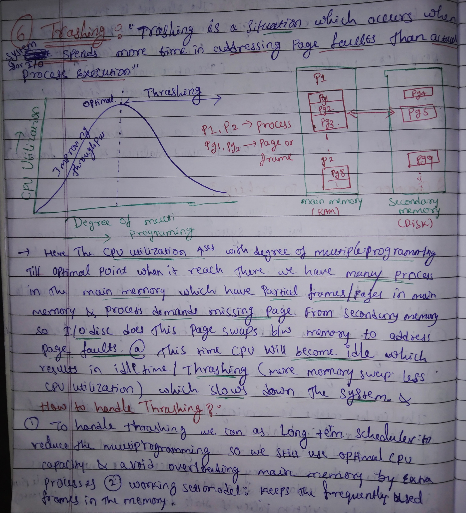
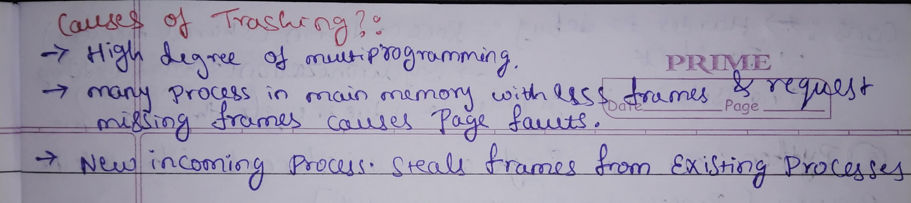
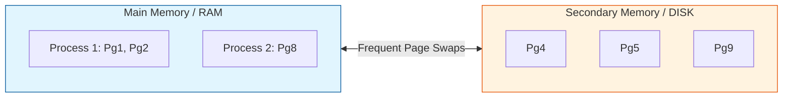
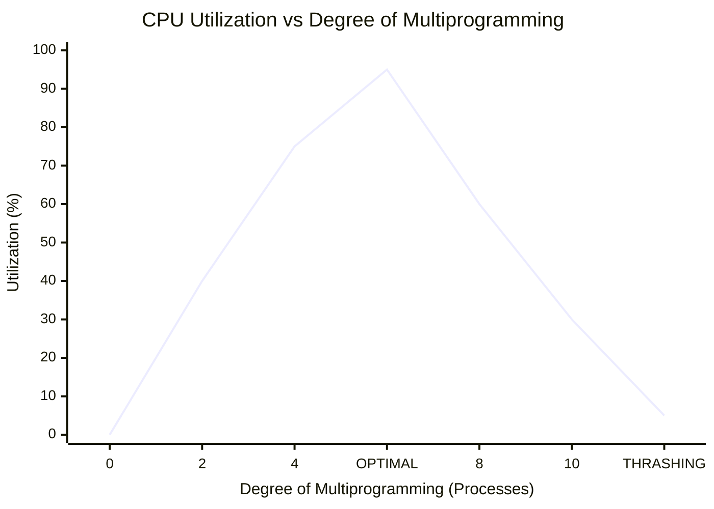

# 🚀 Understanding OS Thrashing

## 📝 Notes

    
  

---

## 📚 Table of Contents

- [📌 Definition](#definition)
- [📉 The Thrashing Phenomenon](#the-thrashing-phenomenon)
- [⚠️ Causes of Thrashing](#causes-of-thrashing)
- [🛠️ How to Handle Thrashing](#how-to-handle-thrashing)
- [🏗️ Visual Breakdown: Memory vs. Disk](#visual-breakdown-memory-vs-disk)
- [📝 Summary](#summary)

---
## 📌 Definition
> **Thrashing** is a specific state in operating systems where the system spends significantly more time swapping pages in and out of memory than actually executing instructions. This leads to a massive drop in CPU utilization and overall system performance.

---

## 📉 The Thrashing Phenomenon
As the **Degree of Multiprogramming** (the number of processes in memory) increases, CPU utilization follows a specific curve:

1.  ✅ **Optimal Point:** Initially, adding more processes increases CPU utilization because the CPU always has a task to perform while others wait for I/O.
2.  ⚠️ **The Collapse:** Once the memory is over-saturated, processes begin demanding "missing pages" from secondary memory (disk).
3.  💥 **The Result:** The I/O disk becomes a bottleneck. The CPU becomes idle while waiting for page swaps, causing the OS to mistakenly think it needs *more* processes to keep the CPU busy, worsening the cycle.

---

## ⚠️ Causes of Thrashing
There are three primary drivers that lead to a system "thrashing":

- ❗ **High Degree of Multiprogramming:** Loading too many processes into the RAM simultaneously.
- 📉 **Memory Scarcity:** Too many processes sharing too few frames; every process requests missing pages, leading to constant **Page Faults**.
- 🔄 **Global Page Replacement:** When a new incoming process "steals" frames from existing processes, causing those original processes to immediately fault and need their pages back.

---

## 🛠️ How to Handle Thrashing
To prevent the system from grinding to a halt, we can implement these two primary strategies:

### 1. Long-Term Scheduler (LTS)
The LTS can be used to **reduce the degree of multiprogramming**. By decreasing the number of active processes, we ensure each process has enough "optimal CPU capacity" and memory frames to run without constant swapping.

### 2. Working Set Model
This model keeps track of the "Locality of Reference." It ensures that the **frequently used frames** (the Working Set) for each process are kept in the main memory.
* If the sum of the working sets of all processes exceeds the total available memory, the OS suspends a process to free up space and stop the thrashing.

---

## 🏗️ Visual Breakdown: Memory vs. Disk
| Component | Role in Thrashing |
| :--- | :--- |
| **Main Memory (RAM)** | Holds active pages ($Pg1, Pg2$). If full, it triggers swaps. |
| **Secondary Memory (Disk)** | Holds the rest of the process ($Pg4, Pg5$). Slow access speeds here cause the "lag." |
| **I/O Swapping** | The process of moving pages between Disk and RAM. |

---

### 📝 Summary
- 📈 **Increase Multiprogramming** $\rightarrow$ Higher Throughput (until the peak).
- ⚠️ **Too Much Multiprogramming** $\rightarrow$ High Page Faults $\rightarrow$ **Thrashing**.
- ✅ **Solution** $\rightarrow$ Reduce process count or use a Working Set Model.
